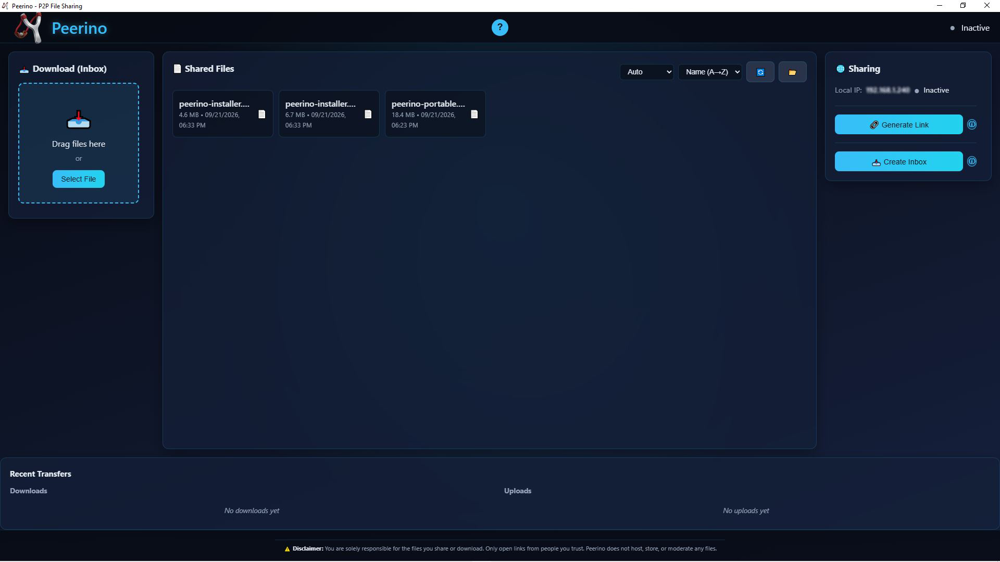
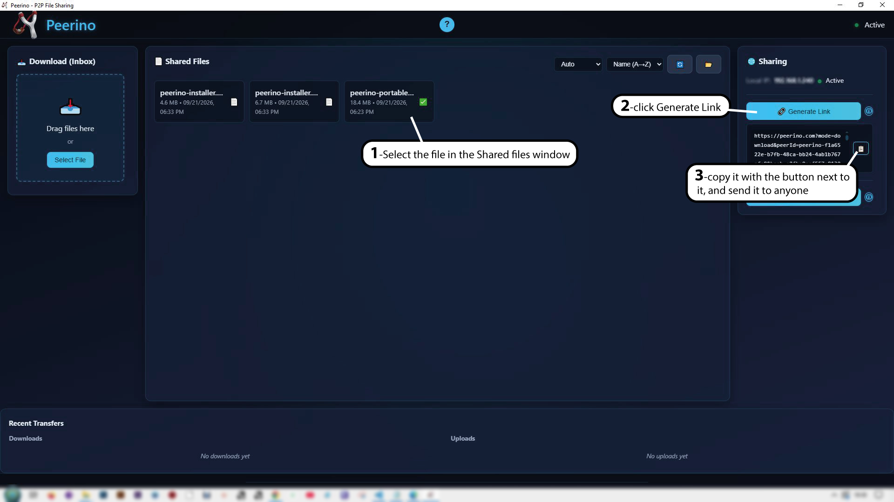
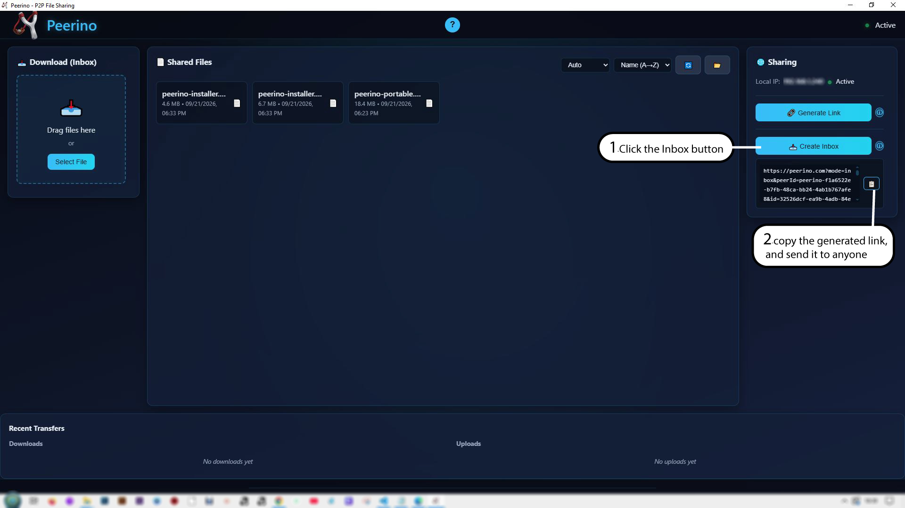

# Peerino

[](https://github.com/Daniele-Tomassoni/peerino/actions/workflows/ci.yml)

**P2P file sharing without cloud and without accounts. Direct when possible, relay when needed.**

Peerino is an open-source desktop application for peer-to-peer file sharing. Send a file to anyone via a simple link — the recipient doesn't need to install anything. Or receive files from anyone, directly on your computer.

---

## Screenshots



### How it works

<table>
  <tr>
    <td width="50%">
      
      <p align="center"><strong>Send a file</strong></p>
    </td>
    <td width="50%">
      
      <p align="center"><strong>Receive a file</strong></p>
    </td>
  </tr>
</table>

---

## ✨ Features

- 🔗 **Share via link**: generate a link, share it, and the recipient downloads the file from their browser
- 📥 **Inbox**: receive files from anyone via a link, without them needing to install Peerino
- 🔒 **Privacy**: file content is encrypted end-to-end with DTLS on all WebRTC connections (direct LAN, STUN, TURN). Note: WebRTC uses ephemeral self-signed certificates, so peer identity is not verified through a PKI. The signaling server sees connection metadata. If a TURN relay is used, it sees encrypted traffic only, but consumes ~2x bandwidth.
- 🏠 **LAN fallback**: direct transfer on the same network, without going through the internet. Uses plain HTTP (not encrypted) for maximum speed; only active when both peers are on the same local network.
- ⚡ **WebRTC P2P**: direct peer-to-peer connection when possible
- 🔄 **TURN relay**: when NAT requires it, a Cloudflare TURN relay forwards the encrypted data
- ✅ **Integrity verification**: SHA-256 hash verified on incoming transfers (browser → app). The hash is computed incrementally by the sender and compared by the receiver; mismatches are rejected before saving.
- 🆓 **Open source**: AGPLv3 licensed, free, no account required
- 💻 **Windows only** (for now; macOS and Linux in roadmap)

---

## 📏 How file size limits work

Peerino tries a direct connection first (LAN or peer-to-peer over the internet).
When a direct connection isn't possible, the transfer falls back to a TURN relay.

**The relay has a per-file limit of 10 MB.** The limit protects the shared
Cloudflare TURN budget. **Direct transfers have no size limit.**

To send files larger than 10 MB, connect both devices to the same WiFi network
when possible, or use a different transfer method. The app shows whether the
transfer is using LAN, a direct P2P path, or a relay.

## 🚀 How it works

### Send a file to someone who doesn't have Peerino

1. Open Peerino
2. Select the file you want to share
3. Click **Generate Link** — the link is shown with a **Copy** button. Click Copy to copy it to the clipboard.
4. Paste it in an email, chat, or any other channel
5. The recipient opens the link in their browser and downloads the file
6. The file is streamed directly from your computer via WebRTC (or a TURN relay if NAT requires it)

### Receive a file from someone who doesn't have Peerino

1. Open Peerino
2. Click **Create Inbox** — a link is generated
3. Copy the link and send it to whoever wants to send you a file
4. The recipient opens the link in their browser and uploads the file
5. The file arrives directly on your computer

---

## 📦 Installation

### Requirements

- Windows 10 or 11 (64-bit)
- WebView2 (preinstalled on recent Windows 10/11)

### Download

Download the latest version from [GitHub Releases](https://github.com/Daniele-Tomassoni/peerino/releases).

Three options:

- **`peerino-installer.exe`** (recommended) — NSIS installer with wizard
- **`peerino-installer.msi`** — MSI installer (enterprise / silent install)
- **`peerino-portable.exe`** — portable executable, no installation required

For the installer, run the `.exe` or `.msi` file and launch Peerino from the Start menu. For the portable, just run the `.exe`.

---

## 🛠️ Build from source

### Prerequisites

- [Node.js](https://nodejs.org/) (LTS)
- [Rust](https://www.rust-lang.org/tools/install) (stable toolchain)
- [Tauri CLI](https://tauri.app/v2/guides/getting-started/prerequisites)

### Commands

```bash
# Install dependencies
npm install

# Start in development mode (hot reload)
npm run tauri dev

# Production build (generates installer)
npm run tauri build
```

The installer is generated in `src-tauri/target/release/bundle/`.

### ⚠️ Windows: Race condition with Windows Defender

On Windows, `npm run tauri dev` can fail with `STATUS_ENTRYPOINT_NOT_FOUND` due to a race condition with Windows Defender. When `cargo run` compiles and immediately executes the binary, Defender can block it during scanning.

**Solutions**:

**Option 1 — Defender exclusion (recommended)**:

```powershell
Add-MpPreference -ExclusionPath "$PWD\src-tauri\target"
```

**Option 2 — Manual development script**:

```powershell
.\dev.ps1
```

The script starts Vite, waits, compiles the Rust backend, waits for Defender's scan, then launches the executable.

---

## ⚙️ Configuration

**The released app works without any configuration.** TURN credentials are
fetched automatically from a Cloudflare Worker (endpoint hardcoded in the
binary). No `.env` file is required.

If you are building from source, or want to self-host the TURN Worker, copy
`.env.example` to `.env` and fill in the variables:

```bash
cp .env.example .env
```

### Variables

| Variable | Description | Default |
|----------|-------------|---------|
| `TURN_CREDENTIALS_ENDPOINT` | URL of the Cloudflare Worker that generates TURN credentials | `https://peerino-turn-proxy.shaft-bdc.workers.dev/api/turn-credentials` |
| `ICE_PROVIDER` | Active ICE provider: `cloudflare` \| `metered` \| `coturn` \| `static` \| `auto` | `cloudflare` |
| `STUN_URLS` | Comma-separated list of STUN servers | Cloudflare, Google |
| `SIGNALING_URL` | Signaling server URL | `0.peerjs.com` |
| `P2P_WEB_URL` | Base URL of the web receiver page. The link is built as `{P2P_WEB_URL}?mode=download&...`. | `https://peerino.com` |
| `HTTP_PORT` | Local HTTP server port | `3000` |
| `TURN_MAX_FILE_SIZE` | Max file size over TURN (bytes). | `10485760` (10 MB) |

> **Note**: Metered is supported as an optional fallback provider. Set `ICE_PROVIDER=metered` and configure `METERED_API_KEY` / `METERED_API_BASE` to use it. Cloudflare TURN is the default.

### TURN server

**TURN server**: Peerino uses Cloudflare TURN for relay connections. The TURN key is kept server-side in a Cloudflare Worker, so it's never exposed in the client. The free tier includes 1 TB/month of egress traffic, which is enough for most use cases.

---

## 🔐 Privacy & Security

- **End-to-end encryption**: all WebRTC connections (STUN, TURN, internet) use DTLS.
- **No central server for file storage**: files are never stored on a remote server. On LAN and STUN, transfers are direct. When NAT requires it, a TURN relay forwards the encrypted data. When both peers are on the same local network, Peerino can fall back to a faster plain-HTTP LAN transfer; this path is not encrypted but never leaves the local network.
- **No account**: no registration, no login
- **Minimal metadata**: the link contains the filename, the file hash, and the sender's Peer ID. Whoever has the link can download the file as long as the sender is online and the file is still in `shared-folder/`.
- **Link expiration**: relay links and inbox links expire after 24 hours. Direct P2P-to-Web links do not have a time-based expiry — they work as long as the sender has the file in `shared-folder/` and Peerino is running.
- **TURN limit**: files up to 10 MB can be transferred via TURN relay. Larger files require a direct connection (LAN or a direct WebRTC path). Direct transfers have no Peerino size limit; this limit protects the shared Cloudflare relay budget.

---

## ⚠️ Current Limitations

- **Windows only**: macOS and Linux in roadmap
- **Mobile app**: in roadmap
- **Credit system**: in roadmap
- **DHT**: decentralized peer discovery in roadmap
- **No authentication**: anyone with the link can download the file

---

## 🤝 Contributing

Peerino is open source and contributions are welcome.

See [CONTRIBUTING.md](CONTRIBUTING.md) for the full guide.

1. Fork the repository
2. Create a branch for your feature (`git checkout -b feature/amazing`)
3. Commit your changes (`git commit -m 'Add amazing feature'`)
4. Push to the branch (`git push origin feature/amazing`)
5. Open a Pull Request

For bugs and requests, open an [Issue](https://github.com/Daniele-Tomassoni/peerino/issues).

---

## 📄 License

Distributed under the **GNU Affero General Public License v3.0 (AGPLv3)**.

This project is free software: you can redistribute it and/or modify it under the terms of the GNU Affero General Public License, version 3, as published by the Free Software Foundation.

See [`LICENSE`](LICENSE) for the full text.

**Note**: if you modify Peerino and offer it as a network service, you must release the source code of your modifications under the same license (this is the main requirement of AGPLv3).

---

## 📬 Contact

- **Email**: support@peerino.com
- **GitHub**: [github.com/Daniele-Tomassoni/peerino](https://github.com/Daniele-Tomassoni/peerino)
- **Issues**: [github.com/Daniele-Tomassoni/peerino/issues](https://github.com/Daniele-Tomassoni/peerino/issues)

---

**Peerino** — Share files. Without cloud. Without accounts.