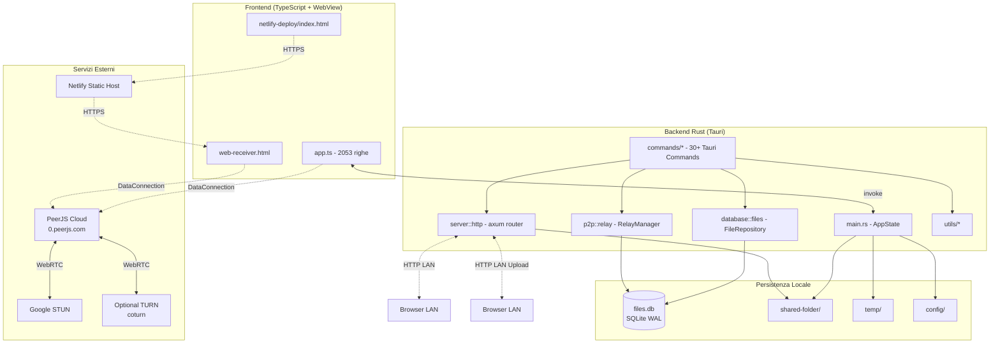

# Peerino — Project Summary Document

> Technical analysis document of the **Peerino** project (P2P File Sharing App), version 3.2.0.
> All claims are supported by evidence found in the source code; in case of doubt, the information is explicitly flagged in the *Limitations* section.

---

## 1. Project Overview

### 1.1 Purpose and Domain
**Peerino** is a cross-platform desktop application for **peer-to-peer file sharing** (P2P) built with **Tauri 2.0** (Rust backend + WebView frontend). The goal stated in file [`project-context.md:30`](project-context.md:30) is to build a *decentralized* file sharing system, *without central servers*, with an incremental architecture organized into six development phases.

The application domain spans from file sharing on local networks (LAN/WiFi) to file distribution over the Internet via WebRTC, with support for direct browser downloads (P2P-to-Web) and file reception from browsers (Reverse Delivery Box). The introduction of an internal credit system (Phase 5) and a mobile app (Phase 6) is planned, both not yet implemented but documented in the roadmap.

### 1.2 Target Audience
- **Desktop end users** who need to share files on local networks or over the Internet without dedicated server infrastructure.
- **Remote recipients** (browser or other Peerino instances) who receive auto-generated public links.
- **Developers** who intend to extend the app according to the roadmap documented in `project-context.md`.

### 1.3 Project Status
- **Current version**: `3.2.0` (see [`package.json:3`](package.json:3), [`src-tauri/Cargo.toml:3`](src-tauri/Cargo.toml:3), [`src-tauri/tauri.conf.json:4`](src-tauri/tauri.conf.json:4)).
- **Completed phase**: Phase 4 (P2P over Internet) with advanced features. The code already contains the robust cancellation system (P0–P3) documented in [`CHECKPOINT.md:1`](CHECKPOINT.md:1).
- **Planned phase**: Phase 5 (local P2P with credits) and Phase 6 (mobile).
- **Development mode**: direct app↔app P2P via PeerJS is implemented but **hidden in the UI** (the manual connection UI was removed; the PeerJS engine runs *headless* to generate the PeerID needed for web links). See [`src/ui/app.ts:902-910`](src/ui/app.ts:902) (commento esplicito) e [`src/ui/index.html`](src/ui/index.html).
- **Repository type**: not a Git repository (see [`CHECKPOINT.md:37`](CHECKPOINT.md:37)).

### 1.4 Distinctive Features
- **Mandatory streaming**: no `Vec<u8>` is passed for files (explicit architectural rule, see [`src-tauri/src/commands/register_file.rs:87-113`](src-tauri/src/commands/register_file.rs:87) e [`src-tauri/src/commands/p2p/stream_file.rs:39-63`](src-tauri/src/commands/p2p/stream_file.rs:39)). Files are handled with `tokio::fs` and 64KB buffers.
- **Tauri Channels** for high-frequency binary streaming (`tauri::ipc::Channel<Vec<u8>>`).
- **Tauri 2.0 capabilities** declared in dedicated files ([`src-tauri/capabilities/default.json`](src-tauri/capabilities/default.json)), never in `tauri.conf.json`.
- **SQLite database with WAL mode** and all operations encapsulated in `tokio::task::spawn_blocking`.
- **Ephemeral TURN credentials** computed locally via HMAC-SHA1 (coturn REST schema) for P2P-to-Web links.
- **Robust cancellation system** for downloads and uploads, with atomic flags (`AtomicBool`) and telemetry.

---

## 2. Stack Tecnologico

### 2.1 Linguaggi e Runtime
| Componente | Tecnologia | Versione | Evidenza |
|------------|------------|----------|----------|
| Backend | Rust (Edition 2021) | 1.75+ | [`src-tauri/Cargo.toml:4`](src-tauri/Cargo.toml:4) |
| Frontend | TypeScript (ES modules) | ^5.0.0 | [`package.json:24`](package.json:24) |
| Markup | HTML5 | - | [`src/ui/index.html`](src/ui/index.html), [`src/ui/web-receiver.html`](src/ui/web-receiver.html) |
| Stile | CSS3 (no framework) | - | [`src/ui/style.css`](src/ui/style.css) |
| Framework desktop | Tauri | ^2.0 | [`src-tauri/Cargo.toml:10`](src-tauri/Cargo.toml:10) |
| Bundler frontend | Vite | ^5.0.0 | [`package.json:26`](package.json:26) |

### 2.2 Dipendenze Rust Principali ([`src-tauri/Cargo.toml`](src-tauri/Cargo.toml))
| Crate | Versione | Ruolo |
|-------|----------|-------|
| `tauri` | 2.0 | Framework desktop; usato con features `default` |
| `tauri-plugin-dialog` | 2.0 | Selezione file nativa |
| `tauri-plugin-clipboard-manager` | 2.0 | Copia link negli appunti |
| `tauri-plugin-notification` | 2.0 | Notifiche di sistema |
| `tauri-plugin-autostart` | 2.0 | Avvio automatico al boot |
| `serde` / `serde_json` | 1.0 | Serializzazione IPC e stato |
| `rusqlite` (bundled) | 0.31 | Database SQLite embedded |
| `tokio` (full) | 1.35 | Runtime asincrono |
| `tokio-util` | 0.7 | `ReaderStream` per streaming |
| `axum` | 0.7 | Server HTTP per LAN |
| `tower` / `tower-http` | 0.4 / 0.5 | Middleware (CORS, timeout, trace) |
| `tokio-stream` | 0.1 | Stream utilities |
| `futures-util` | 0.3 | Trait `Stream` |
| `sha2` / `sha1` | 0.10 | Hashing SHA-256/SHA-1 in streaming |
| `hex` | 0.4 | Encoding esadecimale |
| `hmac` | 0.12 | HMAC-SHA1 per credenziali TURN |
| `base64` (con Engine) | 0.22 | Encoding base64 |
| `uuid` (v4) | 1.6 | Generazione ID link e inbox |
| `urlencoding` | 2.1 | Encoding parametri URL |
| `chrono` | 0.4 | Timestamp RFC3339 |
| `open` | 5.0 | Apertura cartelle e URL nel file manager |
| `log` / `env_logger` | 0.4 / 0.10 | Logging |
| `dotenvy` | 0.15 | Caricamento `.env` |
| `anyhow` / `thiserror` | 1.0 | Gestione errori |
| `tempfile` (dev) | 3.0 | Test temporanei |

### 2.3 Dipendenze JavaScript Principali ([`package.json`](package.json))
| Pacchetto | Versione | Ruolo |
|-----------|----------|-------|
| `@tauri-apps/api` | ^2.0.0 | API Tauri lato JS (`invoke`, `listen`) |
| `@tauri-apps/plugin-dialog` | ^2.0.0 | Dialog nativo per selezione file |
| `@tauri-apps/plugin-clipboard-manager` | ^2.3.2 | Copia testo |
| `@tauri-apps/plugin-notification` | ^2.0.0 | Notifiche di sistema |
| `@tauri-apps/plugin-autostart` | ^2.0.0 | Abilita/disabilita autostart |
| `peerjs` | ^1.5.0 | WebRTC + signaling cloud |
| `vite` (dev) | ^5.0.0 | Bundler dev/build |
| `typescript` (dev) | ^5.0.0 | Compilatore TS |
| `vitest` (dev) | ^1.0.0 | Framework di test |
| `@vitest/ui` (dev) | ^1.0.0 | UI per Vitest |
| `jsdom` / `happy-dom` (dev) | ^29 / ^20 | DOM environment per test |

### 2.4 Runtime Esterni Richiesti
- **Node.js + npm** (per build frontend e test).
- **Rust toolchain** (cargo, rustc 2021 edition).
- **Tauri CLI** (`@tauri-apps/cli ^2.11.4`).
- **WebView2** (Windows) o equivalente del sistema operativo.
- **Connettività Internet** per signaling PeerJS (`0.peerjs.com`) nella modalità P2P-to-Web.
- **Accesso a STUN pubblici Google** (`stun.l.google.com:19302`, `stun1.l.google.com:19302`) — fallback opzionale a TURN.

---

## 3. Architettura e Struttura

### 3.1 Layout delle Cartelle
```
P2P_File_Sharing_App/
├── .env / .env.example            # Configurazione (P2P_WEB_URL, TURN, signaling)
├── package.json                   # Dipendenze e script npm
├── README.md                      # Documentazione di base
├── project-context.md             # Specifica completa (1255 righe)
├── CHECKPOINT.md                  # Snapshot pre-ottimizzazione P0–P3
├── src/                           # Frontend sorgente
│   ├── ui/                        # UI desktop (Tauri)
│   │   ├── index.html             # Layout principale 3 colonne
│   │   ├── app.ts                 # Logica UI (~2053 righe)
│   │   ├── style.css              # Stili
│   │   ├── web-receiver.html      # Pagina di ricezione WebRTC (anche servita in LAN)
│   │   └── icons/                 # Icone applicazione
│   └── tests/unit/                # Test Vitest frontend
│       └── cancel-button.test.ts  # Test dei pulsanti di cancellazione
├── src-tauri/                     # Backend Tauri (Rust)
│   ├── Cargo.toml                 # Manifest dipendenze
│   ├── tauri.conf.json            # Configurazione Tauri (CSP, finestra)
│   ├── build.rs                   # Build script Tauri
│   ├── capabilities/default.json  # Permessi Tauri 2.0 (UNICO file capabilities)
│   ├── icons/                     # Icone multipiattaforma
│   └── src/
│       ├── main.rs                # Entry point + AppState
│       ├── commands/              # Comandi Tauri invocabili
│       │   ├── mod.rs             # Modulo radice
│       │   ├── register_file.rs
│       │   ├── download_file.rs
│       │   ├── download_progress.rs  # Telemetria e tracker download
│       │   ├── list_files.rs
│       │   ├── network_info.rs
│       │   ├── start_server.rs
│       │   ├── folder.rs
│       │   ├── open_url.rs
│       │   ├── local_link.rs
│       │   ├── autostart.rs       # Placeholder (usa plugin)
│       │   ├── clipboard.rs       # Placeholder (usa plugin)
│       │   └── p2p/               # Sotto-modulo P2P (Fase 4)
│       │       ├── mod.rs
│       │       ├── connect.rs
│       │       ├── disconnect.rs
│       │       ├── peers.rs
│       │       ├── generate_link.rs
│       │       ├── stream_file.rs
│       │       ├── create_inbox.rs
│       │       ├── create_inbox_local.rs
│       │       ├── generate_web_link.rs
│       │       ├── set_peer_id.rs
│       │       ├── p2p_file_transfer.rs
│       │       ├── upload_state.rs
│       │       ├── upload_progress.rs
│       │       ├── init_incoming_upload.rs
│       │       ├── append_incoming_chunk.rs
│       │       └── finalize_incoming_file.rs
│       ├── server/                # Server HTTP (axum)
│       │   ├── mod.rs
│       │   └── http.rs            # Router e handler (~778 righe)
│       ├── database/              # Persistenza SQLite
│       │   ├── mod.rs
│       │   └── files.rs           # FileRepository
│       ├── p2p/                   # Modulo P2P (DHT/WebRTC/Relay)
│       │   ├── mod.rs
│       │   ├── dht.rs             # PeerInfo struct
│       │   ├── webrtc.rs          # ICE server config
│       │   └── relay.rs           # RelayManager (link + inbox)
│       └── utils/                 # Utilità
│           ├── mod.rs             # is_safe_filename, get_app_dir
│           ├── network.rs         # get_local_ip
│           ├── peer_id.rs         # get_or_create_peer_id
│           ├── turn_creds.rs      # Credenziali TURN effimere
│           └── temp_cleanup.rs    # Pulizia file orfani
├── shared-folder/                # File condivisi (creata a runtime)
├── config/                        # Persistenza (files.db, peer_id.json)
│   ├── files.db                   # SQLite (WAL mode)
│   ├── files.db-shm / files.db-wal
│   └── peer_id.json               # PeerID persistente
├── netlify-deploy/index.html      # Pagina web statica (Netlify)
└── tests/                         # Test Vitest
    ├── setup.ts                   # Mock Tauri/Plugin
    ├── simple.test.ts
    └── unit/
        ├── ui.test.ts
        └── phase3.test.ts
```

### 3.2 Diagramma dei Componenti



### 3.3 Comunicazione Frontend↔Backend
- **IPC sincrono** via `@tauri-apps/api/core` → `invoke(cmd, args)`.
- **Eventi asincroni** via `@tauri-apps/api/event` → `listen('upload-progress' | 'download-progress' | 'system-resumed')`.
- **Streaming binario** via `tauri::ipc::Channel<Vec<u8>>` (vedi [`src-tauri/src/commands/p2p/stream_file.rs:10-66`](src-tauri/src/commands/p2p/stream_file.rs:10)).
- **Persistenza configurazioni** tramite `localStorage` (es. `autoStartServer`, vedi [`src/ui/app.ts:1902`](src/ui/app.ts:1902)).

---

## 4. Componenti Principali

### 4.1 Backend Rust

#### 4.1.1 [`main.rs`](src-tauri/src/main.rs) — Entry point e AppState
- **Responsabilità**: inizializzazione logging (`env_logger`), `.env` (`dotenvy`), Tauri builder, plugin (dialog, clipboard, notification, autostart), stato applicativo, handler globale di ripresa da ibernazione.
- **`AppState`** contiene:
  - `file_index`: `Arc<tokio::sync::Mutex<HashMap<String, FileInfo>>>` (indice in memoria).
  - `db`: `Arc<tokio::sync::Mutex<rusqlite::Connection>>` (persistenza SQLite).
  - `shared_folder`, `temp_folder`, `config_folder`: path assoluti basati su `get_app_dir()`.
  - `server_running`, `server_shutdown_tx`, `server_handle`: gestione server HTTP.
  - `download_tracker` e `upload_tracker`: tracciamento e telemetria.
  - `relay_manager`: gestione link e inbox pubblici.
  - `peer_id` e `pending_file_hash`: stato P2P corrente.
  - `incoming_uploads`: `HashMap<peer_id, UploadState>` per upload incrementali.
- **Task asincroni avviati al setup**:
  1. Creazione cartelle e inizializzazione DB con `WAL mode`.
  2. `repo.init_table()` + `repo.scan_and_populate()` (idempotente).
  3. Caricamento file dal DB nell'indice in memoria.
  4. Pulizia file temporanei orfani (loop orario, [`utils/temp_cleanup.rs`](src-tauri/src/utils/temp_cleanup.rs)).
  5. Pulizia link/inbox scaduti (loop orario, [`p2p/relay.rs`](src-tauri/src/p2p/relay.rs)).
- **Hook di sistema**: ascolto eventi `tauri://resume` e `tauri://resumed` con delay di 2s su Windows (per stabilizzazione rete post-ibernazione).

#### 4.1.2 Comandi Core (File Management)
| File | Comandi | Responsabilità |
|------|---------|----------------|
| [`commands/register_file.rs`](src-tauri/src/commands/register_file.rs) | `register_file` | Apre file sorgente in streaming, calcola SHA-256, copia in `shared-folder/` con risoluzione conflitti (`name_1.ext`), indice + DB. Limite 1000 file. |
| [`commands/download_file.rs`](src-tauri/src/commands/download_file.rs) | `download_file` | Validazione filename/path, copia in streaming con tracciamento progresso, `sync_all()` finale, supporto cancellazione. |
| [`commands/list_files.rs`](src-tauri/src/commands/list_files.rs) | `list_files`, `refresh_files` | Lista file ordinata per data, filtraggio file non più esistenti, `refresh_files` esegue anche `scan_and_populate`. |
| [`commands/download_progress.rs`](src-tauri/src/commands/download_progress.rs) | `get_download_progress`, `cancel_download`, `get_download_metrics` | Tracker download con `AtomicBool`, telemetria `cancellations_total`, `is_cancelled` sincrono via `try_lock`. |
| [`commands/p2p/upload_progress.rs`](src-tauri/src/commands/p2p/upload_progress.rs) | `get_upload_progress`, `cancel_upload`, `get_upload_metrics` | Tracker upload (chiavi `peer_id-hash`), telemetria, `is_cancelled` sincrono. |

#### 4.1.3 Comandi P2P (Fase 4)
| File | Comandi | Responsabilità |
|------|---------|----------------|
| [`commands/p2p/connect.rs`](src-tauri/src/commands/p2p/connect.rs) | `connect_to_peer` | Placeholder (validazione peer_id vuoto; la connessione reale è gestita dal frontend via PeerJS). |
| [`commands/p2p/disconnect.rs`](src-tauri/src/commands/p2p/disconnect.rs) | `disconnect_from_peer` | Placeholder. |
| [`commands/p2p/peers.rs`](src-tauri/src/commands/p2p/peers.rs) | `list_peers` | Ritorna lista vuota (la discovery è frontend-side). |
| [`commands/p2p/generate_link.rs`](src-tauri/src/commands/p2p/generate_link.rs) | `generate_public_link` | Genera link con scadenza e max-downloads via `RelayManager`. |
| [`commands/p2p/stream_file.rs`](src-tauri/src/commands/p2p/stream_file.rs) | `stream_file` | **Streaming via Tauri Channel** (64KB chunks), controllo cancellazione sincrono. |
| [`commands/p2p/create_inbox.rs`](src-tauri/src/commands/p2p/create_inbox.rs) | `create_inbox` | Genera link inbox con TTL TURN allineato (24h). |
| [`commands/p2p/create_inbox_local.rs`](src-tauri/src/commands/p2p/create_inbox_local.rs) | `create_inbox_local` | Genera link inbox LAN puro HTTP (`/inbox/{id}`). |
| [`commands/p2p/generate_web_link.rs`](src-tauri/src/commands/p2p/generate_web_link.rs) | `generate_web_link` | Genera link P2P-to-Web completo (peerId, hash, filename, ICE config). |
| [`commands/p2p/set_peer_id.rs`](src-tauri/src/commands/p2p/set_peer_id.rs) | `set_peer_id` | Aggiorna `peer_id` corrente nell'AppState. |
| [`commands/p2p/p2p_file_transfer.rs`](src-tauri/src/commands/p2p/p2p_file_transfer.rs) | `get_file_info`, `read_file_chunk`, `get_pending_file_hash`, `clear_pending_file_hash` | Lettura file a chunk da 256KB per WebRTC (base64). |
| [`commands/p2p/upload_state.rs`](src-tauri/src/commands/p2p/upload_state.rs) | (modulo) | `UploadState` con `tokio::fs::File` aperto, hasher SHA-256 incrementale, `temp_path`. |
| [`commands/p2p/init_incoming_upload.rs`](src-tauri/src/commands/p2p/init_incoming_upload.rs) | `init_incoming_upload` | Crea `UploadState` (temp file in `temp/`), validazione filename. |
| [`commands/p2p/append_incoming_chunk.rs`](src-tauri/src/commands/p2p/append_incoming_chunk.rs) | `append_incoming_chunk` | Append di un chunk al file temporaneo, aggiorna hasher. |
| [`commands/p2p/finalize_incoming_file.rs`](src-tauri/src/commands/p2p/finalize_incoming_file.rs) | `finalize_incoming_file` | Rinomina temp → shared, salva DB, aggiorna indice, ritorna hash. |

#### 4.1.4 Server HTTP ([`server/http.rs`](src-tauri/src/server/http.rs))
- **Runtime**: `axum` 0.7 su `tokio::net::TcpListener` bindato a `0.0.0.0:3000` (porta configurabile in `DEFAULT_HTTP_PORT`).
- **Router**:
  | Metodo | Path | Handler | Descrizione |
  |--------|------|---------|-------------|
  | GET | `/` | `receiver_page_handler` | Serve `web-receiver.html` (pagina WebRTC receiver, anche via Cloudflare Tunnel). |
  | GET | `/receiver` | `receiver_page_handler` | Alias del precedente. |
  | GET | `/files` | `list_files_handler` | JSON con tutti i file (per test/tunnel). |
  | GET | `/get/:link_id` | `relay_download_handler` | Consuma link pubblico e fa streaming del file. |
  | GET | `/download/:hash` | `download_file_handler` | Download diretto via hash. |
  | GET | `/inbox/:inbox_id` | `inbox_page_handler` | Pagina upload HTTP puro (placeholder `{INBOX_ID}`). |
  | POST | `/inbox/:inbox_id` | `inbox_upload_handler` | Upload diretto, SHA-256 in streaming, salvataggio con conflict resolution. |
  | GET | `/ping` | `ping_handler` | Probe LAN (postMessage 'pong'). |
- **Middleware**: `TimeoutLayer` (5 min), `CorsLayer` (Any).
- **Stream custom `ProgressTrackingStream`**: monitora `cancelled_flag` (AtomicBool) ad ogni chunk, emette eventi Tauri `upload-progress` / `download-progress`, calcola velocità in MB/s.
- **Cancellazione**: l'header `Accept-Ranges: bytes` è impostato ma il parsing Range non è implementato (vedi `CHECKPOINT.md:21-22` — P3 not done).

#### 4.1.5 Database ([`database/files.rs`](src-tauri/src/database/files.rs))
- **Schema** (singola tabella `files`):
  ```sql
  CREATE TABLE files (
      hash TEXT PRIMARY KEY,
      filename TEXT NOT NULL,
      size INTEGER NOT NULL,
      uploaded_at TEXT NOT NULL
  );
  ```
- **Pattern**: `FileRepository` con `tokio::task::spawn_blocking` su ogni metodo (`init_table`, `save`, `load_all`, `find_by_hash`, `remove`, `count`, `scan_and_populate`).
- **Ottimizzazione scan**: `scan_and_populate` legge prima i filename esistenti e calcola l'hash solo per i file non presenti.
- **WAL mode**: attivato in `main.rs:180` con `conn.pragma_update(None, "journal_mode", &"WAL")`.

#### 4.1.6 Modulo P2P ([`p2p/`](src-tauri/src/p2p/))
- [`dht.rs`](src-tauri/src/p2p/dht.rs): solo la struct `PeerInfo { peer_id, addresses, last_seen }`. Implementazione DHT **non presente** (placeholder per Fase 5).
- [`webrtc.rs`](src-tauri/src/p2p/webrtc.rs): `IceServer`, `WebRtcConfig` con STUN Google di default; `with_turn()` aggiunge `global.turn.metered.ca`; `get_ice_servers_json()` per il frontend. Configurazione runtime **non attiva** (i parametri ICE arrivano via env o via link).
- [`relay.rs`](src-tauri/src/p2p/relay.rs): **`RelayManager`** è il vero orchestratore dei link pubblici. Tiene in memoria:
  - `links: HashMap<link_id, PublicLink>` (file_hash, expires_at, max_downloads, downloads_count).
  - `inboxes: HashMap<inbox_id, Inbox>` (created_at, expires_at).
  - Operazioni atomiche: `validate_and_consume_link` (controllo expiry + counter in lock unico, rimozione automatica al raggiungimento del limite).
  - Pulizia oraria scaduti.

#### 4.1.7 Utility ([`utils/`](src-tauri/src/utils/))
- [`mod.rs`](src-tauri/src/utils/mod.rs): `is_safe_filename` (rifiuta `..`, `/`, `\`), `get_app_dir` (basato su `current_exe()`).
- [`network.rs`](src-tauri/src/utils/network.rs): `get_local_ip()` con fallback a probe UDP verso `8.8.8.8`, `1.1.1.1`, `9.9.9.9`.
- [`peer_id.rs`](src-tauri/src/utils/peer_id.rs): `get_or_create_peer_id` persiste `config/peer_id.json` per stabilità dei link tra riavvii.
- [`turn_creds.rs`](src-tauri/src/utils/turn_creds.rs): schema **coturn REST** — `username = unix_expiry`, `credential = base64(HMAC-SHA1(secret, username))`. Configurabile via `TURN_URLS`, `TURN_AUTH_SECRET`, `TURN_CRED_TTL_SECS` (default 7200s). TURN attivo **solo** se entrambi secret e URL sono configurati.
- [`temp_cleanup.rs`](src-tauri/src/utils/temp_cleanup.rs): rimozione file più vecchi di 1 ora in `temp/` e `.tmp` in `shared-folder/`.

### 4.2 Frontend

#### 4.2.1 [`index.html`](src/ui/index.html) — Layout Desktop
Layout a 3 colonne con header e footer:
- **Header**: logo + LED stato server + testo stato.
- **Left panel (280px)**: drag&drop upload, lista download (inbox).
- **Center panel (1fr)**: lista file condivisi con selezione colonna (Auto/1/2/3) e ordinamento (Name/Size/Date), pulsanti refresh e apri cartella.
- **Right panel (320px)**: sezione Sharing con IP locale, generazione link (Generate Link, Create Inbox), upload progress.
- **Recent Transfers**: log suddiviso in download/upload, evidenzia i trasferimenti ultimi 2 minuti.
- **Footer**: checkbox autostart + status footer.

#### 4.2.2 [`app.ts`](src/ui/app.ts) — Logica UI (~2053 righe)
Moduli interni identificati tramite commenti di sezione:

| Sezione | Linee indicative | Funzionalità |
|---------|-----------------|--------------|
| Connection path detection | 203-308 | `detectConnectionPath()` legge `RTCPeerConnection.getStats()` per determinare se la connessione passa per TURN; gestione tooltip globale per LED. |
| Utility | 310-354 | `escapeHtml`, `getErrorMessage`, `formatSize`, `formatDate`, `showNotification`, `updateServerLed`. |
| Upload/Download progress | 370-543 | Rendering reattivo delle righe: creazione skeleton una volta, update *in place* via `textContent` per evitare click fantasma sul pulsante Annulla. |
| Recent Transfers | 546-598 | Log in memoria (max 50), timestamp `it-IT`. |
| File list | 600-692 | Sort, column layout, gestione `.file-item.selected`. |
| Upload | 694-735 | `handleUpload` → `invoke('register_file', { filePath })`. |
| Network/Link | 737-862 | `loadNetworkInfo`, `handleStartServer`, `ensureServerRunning` (auto-start al primo link), `handleGenerateLocalLink`, `handleOpenFolder`, `handleAutostartChange`. |
| Drag & Drop | 864-895 | `handleDrop` con path nativo Tauri. |
| Context | 897-910 | `updateContext` rende visibili tutte le sezioni (unificato locale/internet). |
| P2P setup | 912-1018 | `iceServers` con TURN opzionale, `initPeer` con PeerID persistente + auto-reconnect esponenziale (max 10 tentativi). |
| System resume | 1020-1052 | `handleSystemResume` riavvia HTTP server e PeerJS dopo ibernazione. |
| Stream to connection | 1054-1215 | `streamFileToConnection` con backpressure (`conn.dataChannel.bufferedAmount > 1MB`), chunk 256KB via `read_file_chunk` (base64 → Uint8Array). |
| Incoming connection | 1217-1273 | `handleIncomingConnection` con serializzazione messaggi per-peer (Promise queue) per evitare race `upload_end` vs `append` finale. |
| Incoming message | 1275-1539 | `processIncomingMessage` gestisce: `request_file`, `cancel_upload`, `upload_file` (inizializzazione), `upload_end` (finalize), `file-offer`/`file-chunk`/`file-complete` (P2P-to-P2P). |
| Connect/Disconnect | 1553-1602 | UI di connessione manuale rimossa, funzioni mantenute per compatibilità. |
| Web link generation | 1626-1663 | `generateWebLink` chiama `ensureServerRunning` per includere `lan=...` nel link. |
| Reverse Inbox | 1700-1736 | `handleCreateInboxLocal` e `handleCreateInboxInternet`. |
| Event listeners | 1738-1781 | Wiring DOM. |
| Listen progress events | 1796-1852 | `listen('download-progress')` e `listen('upload-progress')`, polling 500ms per upload HTTP. |
| DOMContentLoaded | 1893-2050 | Init, autoload files, autostart condizionato, listener globali per click su `.cancel-btn` con gestione differenziata download/upload (animazione `.cancelling`, notifica mittente via `conn.send({type:'cancel_upload'})`). |

#### 4.2.3 [`web-receiver.html`](src/ui/web-receiver.html) & [`netlify-deploy/index.html`](netlify-deploy/index.html)
- Sono **file gemelli** (contenuto identico) usati per la ricezione P2P lato browser.
- Caricano `peerjs@1.5.2` e `js-sha256@0.9.0` da CDN.
- Leggono i parametri URL (`mode=download|inbox`, `peerId`, `hash`, `filename`, `signal`, `stunUrls`, `turnUrls`, `turnUser`, `turnPass`, `lan`) e instaurano la connessione WebRTC.
- Implementano UI di download/upload con progress bar, fasi di connessione, e supporto fallback LAN diretto.

#### 4.2.4 Comunicazione con il Backend
Pattern tipico:
```typescript
import { invoke } from '@tauri-apps/api/core';
const hash = await invoke<string>('register_file', { filePath: '/path/to/file' });
```
Gli eventi sono ascoltati con:
```typescript
import { listen } from '@tauri-apps/api/event';
await listen<DownloadProgress>('download-progress', (event) => { /* ... */ });
```

---

## 5. Funzionalità

### 5.1 Funzionalità Implementate (stato: operative)
| ID | Funzionalità | Stato | Evidenza |
|----|--------------|-------|----------|
| F-01 | Upload locale via dialog | ✅ | `handleSelectFile` → `register_file` |
| F-02 | Drag & drop file | ✅ | `handleDrop` (path nativo Tauri) |
| F-03 | Calcolo SHA-256 in streaming (64KB buffer) | ✅ | `register_file.rs:71-113` |
| F-04 | Download locale via `download_file` con path assoluto validato | ✅ | `download_file.rs:16-35` (`validate_target_path`) |
| F-05 | Persistenza DB SQLite WAL | ✅ | `main.rs:180-189`, `database/files.rs` |
| F-06 | Limite 1000 file indicizzati | ✅ | `MAX_FILES` in `register_file.rs:9` |
| F-07 | Pulizia automatica temp/ e `.tmp` orfani (1h) | ✅ | `utils/temp_cleanup.rs` |
| F-08 | Avvio/Stop server HTTP con rilevamento errori di bind sincroni | ✅ | `commands/start_server.rs:54-58` |
| F-09 | Rilevamento IP locale con fallback | ✅ | `utils/network.rs:14-67` |
| F-10 | CORS + timeout 5 min su server HTTP | ✅ | `http.rs:519-520` |
| F-11 | Download via link locale (LAN) | ✅ | `GET /download/:hash` |
| F-12 | Upload via inbox locale (HTTP puro) con SHA-256 in streaming | ✅ | `POST /inbox/:inbox_id` |
| F-13 | Generazione link pubblici con scadenza + max downloads | ✅ | `p2p/relay.rs:64-92` |
| F-14 | Consumazione atomica link pubblici | ✅ | `relay.rs:102-137` (lock unico) |
| F-15 | P2P-to-Web Link (Netlify + WebRTC) | ✅ | `generate_web_link.rs` |
| F-16 | Inbox Internet con TTL TURN allineato a 24h | ✅ | `create_inbox.rs:55` |
| F-17 | Inbox locale (LAN) HTTP-only | ✅ | `create_inbox_local.rs` |
| F-18 | Streaming binario via Tauri Channel | ✅ | `p2p/stream_file.rs` |
| F-19 | Upload incrementale browser→app (3 fasi) | ✅ | `init/append/finalize_incoming_*` |
| F-20 | Tracciamento progresso con backpressure | ✅ | `app.ts:1054-1215` (`bufferedAmount` 1MB) |
| F-21 | Cancellazione download con flag atomico | ✅ | `download_progress.rs:96-123` |
| F-22 | Cancellazione upload con notifica mittente | ✅ | `app.ts:1955-1968` (`{type:'cancel_upload'}`) |
| F-23 | Telemetria cancellazioni (download/upload) | ✅ | `get_download_metrics`, `get_upload_metrics` |
| F-24 | Notifica mittente via `cancel_upload` quando receiver annulla | ✅ | `app.ts:1965` |
| F-25 | Serializzazione messaggi per-peer (anti race) | ✅ | `uploadMessageQueues` |
| F-26 | PeerID persistente per stabilità link | ✅ | `utils/peer_id.rs` + `app.ts:952-960` |
| F-27 | Auto-reconnect PeerJS con backoff esponenziale | ✅ | `app.ts:989-1004` (max 10, 2s×1.5^n) |
| F-28 | Gestione hibernazione/sospensione (ripristino connessioni) | ✅ | `main.rs:140-149` + `app.ts:1020-1052` |
| F-29 | Drag&drop + selezione nativa | ✅ | `@tauri-apps/plugin-dialog` |
| F-30 | Copia link con un click | ✅ | `copyToClipboard` + plugin clipboard |
| F-31 | Notifiche di sistema | ✅ | `sendNotification` (upload/download completati) |
| F-32 | Apertura cartella condivisa | ✅ | `commands/folder.rs` (`open` crate) |
| F-33 | Avvio automatico al boot | ✅ | `tauri-plugin-autostart` + capability |
| F-34 | LED connessione (verde=diretto, giallo=TURN) | ✅ | `app.ts:221-249` (`getStats`) |
| F-35 | Tooltip globale posizionato fisso | ✅ | `app.ts:268-308` |
| F-36 | TURN credentials effimere (schema coturn REST) | ✅ | `utils/turn_creds.rs` |
| F-37 | Allineamento TTL TURN alla validità inbox (24h) | ✅ | `create_inbox.rs:55` |
| F-38 | File ricevuti via inbox salvati in `shared-folder/` con conflict resolution | ✅ | `http.rs:341-356`, `finalize_incoming_file.rs:50-65` |
| F-39 | Recent transfers log (in-memory, max 50) | ✅ | `app.ts:546-598` |
| F-40 | Polling 500ms upload HTTP (alternativa agli eventi) | ✅ | `app.ts:1856-1891` |
| F-41 | Selezione multipla file + colonne (Auto/1/2/3) | ✅ | `applyColumnLayout` |
| F-42 | Ordinamento (nome/dimensione/data) | ✅ | `sortFiles` |
| F-43 | Compressione/Encoding base64 per chunk P2P | ✅ | `p2p_file_transfer.rs:85` |
| F-44 | Probe LAN per fallback HTTP diretto | ✅ | `/ping` + postMessage |

### 5.2 Funzionalità Pianificate / Parziali
| ID | Funzionalità | Stato | Note |
|----|--------------|-------|------|
| F-45 | DHT per discovery globale | 🚧 Placeholder | `p2p/dht.rs` solo struct, Fase 5 |
| F-46 | mDNS per discovery locale | 🚧 Pianificata | Fase 5 (rust-libp2p) |
| F-47 | Sistema crediti interi (1 cr = 100 punti) | 🚧 Pianificata | Fase 5 |
| F-48 | Mutua validazione ledger con firme ed25519 | 🚧 Pianificata | Fase 5 |
| F-49 | App mobile (iOS/Android) | 🚧 Pianificata | Fase 6 (Tauri Mobile/React Native) |
| F-50 | QR Code Pairing offline | 🚧 Pianificata | Fase 6 (vedi `project-context.md:651-678`) |
| F-51 | Eco-Salva (limitazioni WiFi+carica) | 🚧 Pianificata | Fase 6 |
| F-52 | Cartella Ghost biometrica | 🚧 Pianificata | Fase 6 |
| F-53 | Header HTTP `Accept-Ranges` onorato | ⚠️ Parziale | Header inviato ma Range non parsato (P3 del CHECKPOINT) |
| F-54 | Connessione P2P app↔app manuale | ⚠️ Nascosta | UI rimossa; logica PeerJS headless |
| F-55 | Cifratura AES-256-GCM lato client | 📝 Specificata | Non implementata nel codice attuale |

---

## 6. Flusso di Esecuzione

### 6.1 Avvio Applicazione
```
1. `main()` → env_logger::init() → dotenvy::dotenv()
2. Definizione AppState (in-memory HashMap, in-memory DB placeholder)
3. Registrazione plugin (dialog, clipboard, notification, autostart)
4. invoke_handler con 30+ comandi
5. .setup():
   ├─ Listener eventi 'tauri://resume'/'resumed'
   ├─ Spawn: creazione cartelle, apertura DB persistente, WAL mode
   ├─ Spawn: init_table + scan_and_populate + load_all
   ├─ Spawn: temp_cleanup loop (ogni ora)
   └─ Spawn: relay cleanup loop (ogni ora)
6. .run(generate_context!()) → avvio WebView
7. Frontend: DOMContentLoaded → loadFiles, loadNetworkInfo, initPeer
8. PeerJS connessione → 'open' → set_peer_id backend → UI diventa attiva
```

### 6.2 Upload di un File Locale
```
1. Utente clicca "Select File" o drag&drop
2. Frontend: @tauri-apps/plugin-dialog open() → path
3. invoke('register_file', { filePath })
4. Backend:
   a. Validazione esistenza
   b. Risoluzione conflitti nome (name_1.ext)
   c. Controllo MAX_FILES (lock breve)
   d. Apre source + target in streaming
   e. Loop: read 64KB → hasher.update → write_all
   f. Calcola hash hex
   g. Insert in file_index + spawn save su DB
   h. Restituisce hash
5. Frontend: loadFiles() → render aggiornato
```

### 6.3 Generazione P2P-to-Web Link
```
1. Utente seleziona file e clicca "Generate Link"
2. ensureServerRunning() → start_http_server se spento
3. invoke('generate_web_link', { hash })
4. Backend:
   a. Lookup file in file_index
   b. Verifica esistenza su disco
   c. Recupera peer_id corrente
   d. pending_file_hash := Some(hash)
   e. Costruisce URL base = P2P_WEB_URL || default Netlify
   f. Aggiunge parametri: mode=download, peerId, hash, filename
   g. ice_link_config_from_env() → signaling, stunUrls, turn (se configurato)
   h. Se server_running → aggiunge &lan=http://IP:3000
   i. Restituisce URL completo
5. Frontend mostra link, copia con un click
```

### 6.4 Download P2P-to-Web (browser → app)
```
1. Destinatario apre link nel browser
2. web-receiver.html legge query string, inizializza PeerJS
3. Connessione a peerId del mittente via signaling (0.peerjs.com + STUN/TURN)
4. Mittente (app): peer.on('connection') → handleIncomingConnection
5. Frontend mittente: get_pending_file_hash → invia {type:'ready', hash}
6. Frontend browser: {type:'request_file', hash} → mittente riceve
7. streamFileToConnection (mittente):
   a. get_file_info (verifica disco)
   b. Invia {type:'file_meta', filename, size, hash}
   c. Loop:
      - check cancelled
      - read_file_chunk (256KB base64)
      - atob → Uint8Array
      - backpressure se bufferedAmount > 1MB
      - conn.send(bytes)
      - update activeUploads + render
   d. clear_pending_file_hash
8. Frontend browser: riceve binary chunks, hash in streaming, salva
```

### 6.5 Upload Browser → App (Internet Inbox)
```
1. Mittente apre link inbox
2. web-receiver.html modalità upload: drop file
3. Hash SHA-256 calcolato lato browser
4. Connette a peerId via WebRTC
5. Invia {type:'upload_file', filename, size, hash}
6. App (handleIncomingConnection → processIncomingMessage):
   a. incomingUploads.set(peer, {filename, size, expectedHash, ...})
   b. invoke('init_incoming_upload', {peerId, filename, size, expectedHash})
   c. Backend: crea UploadState con temp file in temp/
   d. conn.send({type:'upload_accepted'})
7. Browser invia chunk binari (con backpressure, 64KB via FileReader)
8. App per ogni chunk: invoke('append_incoming_chunk', {peerId, chunk})
   a. Backend: scrive su file, aggiorna hasher, written
9. Browser invia {type:'upload_end'}
10. App: invoke('finalize_incoming_file', {peerId})
    a. Backend: drop(file), rename temp → shared (Windows-safe), DB save, index update
    b. Ritorna hash
11. App: conn.send({type:'upload_complete'}), loadFiles()
```

### 6.6 Upload Browser → App (LAN Inbox, HTTP puro)
```
1. Mittente apre http://IP:3000/inbox/{id}
2. Backend (GET): inbox_page_handler serve HTML con drag&drop
3. Calcolo SHA-256 lato browser
4. POST /inbox/{id}?filename=...&hash=... (XHR)
5. Backend (POST): inbox_upload_handler
   a. Validazione inbox esistente
   b. Validazione filename (is_safe_filename)
   c. Conflict resolution su shared-folder
   d. Content-Length → target
   e. Loop chunk: hasher.update + write_all + check cancelled + emit progress
   f. Flush, rename confermato
   g. file_index.insert + DB save async
   h. Emit download-progress finale
6. Browser riceve {status: ok, hash, filename}
```

### 6.7 Sistema di Cancellazione (Unificato)
```
Download (utente clicca ✕ su riga download):
1. Frontend: click delegation → cancelBtn.closest('.cancel-btn')
2. data-download-key presente → isDownload = true
3. invoke('cancel_download', { hash })
   a. Backend: download_tracker.cancel_download
   b. set cancelled=true su progress
   c. AtomicBool.store(true) per il flag
   d. cancellations_total += 1 (se prima non cancellato)
4. Il loop di streaming (download_file / stream_file / inbox_upload_handler /
   ProgressTrackingStream) controlla is_cancelled(hash) ad ogni chunk e termina
5. Frontend: animazione .cancelling (250ms) + footer "⏹ Download annullato"
6. Per P2P: conn.send({type:'cancel_upload'}) al mittente

Upload (utente clicca ✕ su riga upload):
1. invoke('cancel_upload', { hash })
   a. Backend: upload_tracker.cancel_upload
   b. set cancelled su tutti i record con quel hash
   c. flag.store(true)
   d. counter++
2. Il loop di streamFileToConnection controlla uploadEntry.cancelled ad ogni iterazione
3. read_file_chunk ritorna Err se is_cancelled (controllo sincrono)
```

---

## 7. Configurazione e Installazione

### 7.1 Prerequisiti
- **Node.js** (versione LTS recente con supporto npm).
- **Rust toolchain** (rustc edition 2021, cargo).
- **Tauri 2.0 CLI** (`npm install -g @tauri-apps/cli` o come devDep).
- **WebView2** (Windows 10/11) o WebKit (Linux) o WKWebView (macOS).

### 7.2 Installazione
```bash
npm install                # Dipendenze JS
cd src-tauri && cargo build  # Build backend
# Oppure (consigliato):
npm run tauri dev          # Sviluppo con hot-reload
npm run tauri build        # Build di produzione
```

### 7.3 Script NPM Disponibili
| Script | Comando | Effetto |
|--------|---------|---------|
| `dev` | `vite` | Server di sviluppo frontend |
| `build` | `vite build` | Build frontend |
| `tauri` | `tauri` | CLI Tauri |
| `test` | `vitest --config vitest.config.ts` | Esegui test |
| `test:ui` | `vitest --ui --config vitest.config.ts` | Test con UI |

### 7.4 Variabili d'Ambiente ([`.env.example`](.env.example))
| Variabile | Default | Ruolo |
|-----------|---------|-------|
| `P2P_WEB_URL` | `https://courageous-crisp-cff298.netlify.app` | URL base della pagina receiver su Netlify |
| `P2P_SHARE_URL` | (vuoto → IP locale) | URL pubblico del server Tauri per upload inbox remoto |
| `VITE_TURN_USERNAME` | (vuoto) | Credenziali TURN esposte al frontend (build-time) |
| `VITE_TURN_PASSWORD` | (vuoto) | Password TURN esposta al frontend |
| `SIGNALING_URL` | `0.peerjs.com` | Signaling PeerJS self-hosted |
| `STUN_URLS` | Google STUN (2 server) | Lista STUN separata da virgola |
| `TURN_URLS` | (vuoto) | Lista TURN separata da virgola (abilita TURN) |
| `TURN_AUTH_SECRET` | (vuoto) | Segreto condiviso con coturn |
| `TURN_CRED_TTL_SECS` | 7200 | TTL credenziali TURN effimere |

### 7.5 Configurazione Tauri 2.0 ([`src-tauri/tauri.conf.json`](src-tauri/tauri.conf.json))
- `productName`: "Peerino"
- `identifier`: `com.peerino.app`
- `version`: `3.2.0`
- `build`: `beforeBuildCommand: "npm run build"`, `beforeDevCommand: "npm run dev"`, `devUrl: "http://localhost:5173"`, `frontendDist: "../dist"`
- `app.security.csp`: `default-src 'self'; connect-src 'self' wss://*.peerjs.com wss://*.metered.ca stun: stun.l.google.com:19302 stun1.l.google.com:19302 https://global.turn.metered.ca;`
- `app.windows[0]`: titolo "Peerino - P2P File Sharing", 1280×768, resizable

### 7.6 Capabilities Tauri 2.0 ([`src-tauri/capabilities/default.json`](src-tauri/capabilities/default.json))
Permessi concessi:
- Core: `core:default`, `path:default`, `event:default`, `window:default`, `app:default`, `resources:default`, `menu:default`, `tray:default`
- Dialog: `dialog:allow-open`, `dialog:allow-save`
- Clipboard: `clipboard-manager:allow-write-text`, `clipboard-manager:allow-read-text`
- Notification: `notification:allow-show`
- Autostart: `autostart:allow-enable`, `autostart:allow-disable`, `autostart:allow-is-enabled`

**Nota**: i permessi `fs:*` non sono elencati esplicitamente, ma i comandi custom `register_file`, `download_file`, ecc. operano su path arbitrari (l'utente fornisce il percorso via dialog). I permessi dei plugin Tauri coprono la selezione nativa.

---

## 8. API / Interfacce Esposte

### 8.1 Comandi Tauri (Backend → Frontend via `invoke`)

#### 8.1.1 Gestione File
| Comando | Argomenti | Ritorno | Note |
|---------|-----------|---------|------|
| `register_file` | `{ filePath: string }` | `Promise<string>` (hash) | Max 1000 file, conflict resolution |
| `download_file` | `{ hash: string, targetPath: string }` | `Promise<string>` (filename) | Path assoluto validato |
| `list_files` | `{}` | `Promise<FileInfo[]>` | Ordinato per data discendente |
| `refresh_files` | `{}` | `Promise<FileInfo[]>` | Esegue scan della cartella |
| `get_file_info` | `{ hash: string }` | `Promise<{filename,size,hash}>` | Per P2P send |
| `read_file_chunk` | `{ hash: string, offset: number }` | `Promise<string \| null>` (base64) | 256KB chunk |

#### 8.1.2 Download/Upload Progress
| Comando | Argomenti | Ritorno | Note |
|---------|-----------|---------|------|
| `get_download_progress` | `{}` | `Promise<DownloadProgress[]>` | |
| `cancel_download` | `{ hash: string }` | `Promise<string>` | |
| `get_download_metrics` | `{}` | `Promise<{cancellations_total, active_downloads}>` | Telemetria |
| `get_upload_progress` | `{}` | `Promise<UploadProgress[]>` | Polling 500ms |
| `cancel_upload` | `{ hash: string }` | `Promise<string>` | |
| `get_upload_metrics` | `{}` | `Promise<{cancellations_total, active_uploads}>` | |

#### 8.1.3 Network / Server
| Comando | Argomenti | Ritorno | Note |
|---------|-----------|---------|------|
| `get_network_info` | `{}` | `Promise<{ip: string, port: number}>` | IP non-loopback |
| `start_http_server` | `{}` | `Promise<string>` | Porta 3000 |
| `stop_http_server` | `{}` | `Promise<string>` | Graceful shutdown |
| `open_shared_folder` | `{}` | `Promise<void>` | Cross-platform |
| `check_shared_folder` | `{}` | `Promise<boolean>` | |
| `open_url` | `{ url: string }` | `Promise<void>` | OS browser |
| `generate_local_link` | `{ hash: string }` | `Promise<string>` | Solo se server running |
| `set_peer_id` | `{ peerId: string }` | `Promise<void>` | Da PeerJS frontend |
| `get_persistent_peer_id` | `{}` | `Promise<string>` | `peerino-{uuid}` |

#### 8.1.4 P2P / Internet
| Comando | Argomenti | Ritorno | Note |
|---------|-----------|---------|------|
| `connect_to_peer` | `{ peerId: string }` | `Promise<string>` | Placeholder |
| `disconnect_from_peer` | `{ peerId: string }` | `Promise<void>` | Placeholder |
| `list_peers` | `{}` | `Promise<PeerInfo[]>` | Placeholder (vuoto) |
| `generate_public_link` | `{ hash, expires_in?, max_downloads? }` | `Promise<string>` | 24h / 5 default |
| `stream_file` | `{ hash, channel: Channel<Vec<u8>> }` | `Promise<void>` | 64KB via Channel |
| `create_inbox` | `{}` | `Promise<string>` | Inbox Internet (24h) |
| `create_inbox_local` | `{}` | `Promise<string>` | Inbox LAN HTTP |
| `generate_web_link` | `{ hash, signaling_url?, turn_username?, turn_password? }` | `Promise<string>` | Link Netlify |
| `get_pending_file_hash` | `{}` | `Promise<string \| null>` | P2P-to-Web |
| `clear_pending_file_hash` | `{}` | `Promise<void>` | |

#### 8.1.5 Upload Incrementale (3-fasi)
| Comando | Argomenti | Ritorno | Note |
|---------|-----------|---------|------|
| `init_incoming_upload` | `{ peerId, filename, size, expectedHash }` | `Promise<void>` | Crea temp file |
| `append_incoming_chunk` | `{ peerId, chunk: Uint8Array }` | `Promise<void>` | Write incrementale |
| `finalize_incoming_file` | `{ peerId }` | `Promise<string>` (hash) | Rename + DB |

### 8.2 Eventi Tauri (Backend → Frontend via `listen`)
| Evento | Payload | Note |
|--------|---------|------|
| `download-progress` | `DownloadProgress` | Emesso dal server HTTP e da `download_file` |
| `upload-progress` | `UploadProgress` | Emesso dal server HTTP e da P2P streaming |
| `system-resumed` | `null` | Post-ibernazione (2s delay su Windows) |

### 8.3 Endpoint HTTP (Server Integrato axum)
| Metodo | Path | Parametri | Risposta |
|--------|------|-----------|----------|
| GET | `/` | - | HTML `web-receiver.html` |
| GET | `/receiver` | - | HTML (alias) |
| GET | `/files` | - | JSON `FileInfo[]` |
| GET | `/get/:link_id` | - | File stream (consuma link) |
| GET | `/download/:hash` | - | File stream |
| GET | `/inbox/:inbox_id` | - | HTML upload form |
| POST | `/inbox/:inbox_id` | `?filename=...&hash=...` (raw body) | JSON `{status, hash, filename}` |
| GET | `/ping` | - | HTML con postMessage('pong') |

### 8.4 Comandi CLI Impliciti
- `npm run tauri dev` — modalità sviluppo
- `npm run tauri build` — build di produzione
- `npm test` — esecuzione test Vitest
- `cargo test` (in `src-tauri/`) — test Rust (esistenti solo per `network_info` e `turn_creds`)

### 8.5 Schema Dati
```typescript
interface FileInfo {
    filename: string;
    size: number;
    hash: string;
    uploaded_at: string;  // RFC3339
}

interface DownloadProgress {
    hash: string;
    filename: string;
    total_bytes: number;
    downloaded_bytes: number;
    speed_mbps: number;
    peer_ip: string;
    progress: number;  // 0-100
    cancelled: boolean;
}

interface UploadProgress {
    hash: string;
    filename: string;
    bytes_processed: number;
    total_bytes: number;
    progress: number;
    speed_mbps: number;
    peer_id: string;
    cancelled: boolean;
}

interface PeerInfo {
    peer_id: string;
    addresses: string[];
    last_seen: number;
}

interface NetworkInfo {
    ip: string;
    port: number;
}
```

---

## 9. Gestione Dati e Persistenza

### 9.1 Database SQLite
- **File**: `<app_dir>/config/files.db`
- **Modalità**: WAL (`journal_mode=WAL`, `synchronous=NORMAL`)
- **Schema** (unica tabella):
  ```sql
  CREATE TABLE files (
      hash TEXT PRIMARY KEY,
      filename TEXT NOT NULL,
      size INTEGER NOT NULL,
      uploaded_at TEXT NOT NULL
  );
  ```
- **Pattern di accesso**: ogni operazione DB è incapsulata in `tokio::task::spawn_blocking` con `conn.blocking_lock()` per non bloccare l'async runtime.

### 9.2 Struttura Cartelle Runtime
```
<exe_dir>/
├── shared-folder/          # File condivisi (originali + ricevuti)
├── temp/                   # File temporanei upload incrementali
└── config/
    ├── files.db            # SQLite (con -shm, -wal)
    ├── files.db-shm
    ├── files.db-wal
    └── peer_id.json        # PeerID persistente
```

### 9.3 Caching e Indici
- **Indice in memoria**: `HashMap<String, FileInfo>` sincronizzato con `file_index` (lock async). Aggiornato ad ogni `register_file`, `finalize_incoming_file`, `list_files`, `refresh_files`.
- **Scansione iniziale**: `scan_and_populate` aggiunge file presenti in `shared-folder/` ma non nel DB (saltando dotfile e file già presenti per filename).
- **Nessuna cache esplicita per i download**: ogni `download_file` riapre il file sorgente.

### 9.4 Migrazioni
- Lo schema è **monolitico e immutabile** (nessuna versione di schema). In caso di modifiche future servirebbe aggiungere una tabella `schema_version` o un file `migrations.sql`.

### 9.5 Gestione Conflitti di Nome
Pattern uniforme: `name_1.ext`, `name_2.ext`, ... (usato in `register_file.rs`, `http.rs` inbox, `finalize_incoming_file.rs`).

---

## 10. Sicurezza

### 10.1 Modello di Minaccia
| Minaccia | Mitigazione Implementata |
|----------|--------------------------|
| Path traversal in download/upload | `is_safe_filename` (rifiuta `..`, `/`, `\`); `validate_target_path` richiede path assoluto + cartella esistente |
| OOM da file grandi | Buffer 64KB in streaming, `tokio::fs::File` invece di `Vec<u8>`, no `Vec<u8>` via IPC |
| Hash collision/spoofing | SHA-256 verificato in `finalize_incoming_file` (warn-only, vedi limitazione sotto) |
| MITM su WebRTC | DTLS nativo WebRTC; signaling esterno non fidato (SDP) |
| Link abuse | Scadenza (24h) + max 5 download (configurabile); pulizia oraria |
| Race condition cancellazione | Flag `AtomicBool` con riuso, `try_lock` non bloccante, telemetria `cancellations_total` |
| Race `upload_end` vs `append` finale | Coda Promise serializzata per peer in `app.ts:1222-1235` |
| Backpressure WebRTC | `conn.dataChannel.bufferedAmount > 1MB` → attesa evento `bufferedamountlow` |
| Persistenza credenziali TURN | Schema coturn REST: secret mai nei link; TTL 2h (download) / 24h (inbox) |
| CSP injection | CSP restrittiva in `tauri.conf.json` (solo domini autorizzati per connect-src) |
| DoS via enumerazione | Limite 1000 file indicizzati |
| Browser upload con nome malevolo | `is_safe_filename` lato server, conflict resolution |

### 10.2 Superfici di Attacco Note
- **Signaling PeerJS** (esterno): un attaccante sul signaling potrebbe impersonare un PeerID, ma il P2P-to-Web richiede al destinatario di conoscere l'ID via link sicuro.
- **Pagina Netlify pubblica**: chiunque può aprire un link; il limite di max_downloads e la scadenza mitigano.
- **CSP**: `connect-src` permette `*.peerjs.com`, `*.metered.ca`, Google STUN. Nessun altro dominio esterno è autorizzato.
- **File ricevuti via inbox**: hash mismatch attualmente genera solo un warning (non blocca il salvataggio), vedi [`finalize_incoming_file.rs:31-36`](src-tauri/src/commands/p2p/finalize_incoming_file.rs:31).

### 10.3 Permessi Tauri
Tutti dichiarati in `src-tauri/capabilities/default.json`. I comandi custom (Tauri Commands) non richiedono capability esplicita; la registrazione in `invoke_handler` è sufficiente (il mirroring è menzionato in `CHECKPOINT.md:23`).

### 10.4 Gestione Segreti
- **TURN secret**: solo via `TURN_AUTH_SECRET` env, mai nel codice né nei link.
- **PeerID**: persistito in `config/peer_id.json`; collisione gestita con fallback random (vedi `app.ts:1005-1010`).
- **Nessun altro segreto** (no API key, no token).

### 10.5 Validazione Input
- **Filename**: `is_safe_filename` in ingresso (upload, download, init_incoming_upload, finalize).
- **Path destinazione**: `validate_target_path` (assoluto + parent esiste + filename safe).
- **Hash**: solo verifica esistenza in indice; validazione formato non implementata (si assume output SHA-256 hex a 64 char).
- **PeerID**: rifiuto di stringa vuota.
- **Inbox/Link ID**: validazione server-side con `relay.get_link` / `relay.get_inbox`.

---

## 11. Testing e Qualità del Codice

### 11.1 Framework di Test
- **Backend**: `cargo test` (in `src-tauri/`). Test esistenti in `mod tests` di:
  - [`utils/network.rs:69-80`](src-tauri/src/utils/network.rs:69) — `test_get_local_ip`
  - [`commands/network_info.rs:18-35`](src-tauri/src/commands/network_info.rs:18) — `test_get_network_info` (async)
  - [`utils/temp_cleanup.rs:133-153`](src-tauri/src/utils/temp_cleanup.rs:133) — `test_cleanup_temp_files` (async + tempfile)
  - [`utils/turn_creds.rs:162-189`](src-tauri/src/utils/turn_creds.rs:162) — 3 test su ephemeral credentials
- **Frontend**: Vitest (`vitest ^1.0.0`) con jsdom/happy-dom.

### 11.2 Test Frontend Esistenti
| File | Test | Scopo |
|------|------|-------|
| [`tests/simple.test.ts`](tests/simple.test.ts) | `should work` | Smoke test |
| [`tests/unit/phase3.test.ts`](tests/unit/phase3.test.ts) | 3 test su `formatSize`, `formatDate`, generazione link | Utility UI Fase 3 |
| [`tests/unit/ui.test.ts`](tests/unit/ui.test.ts) | 3 test su `invoke register_file`, `list_files`, `formatSize` | Mock invoke |
| [`src/tests/unit/cancel-button.test.ts`](src/tests/unit/cancel-button.test.ts) | 6 test dettagliati | Pulsanti Annulla (download/upload), animazione, doppio click, footer status |

### 11.3 Mock Setup ([`tests/setup.ts`](tests/setup.ts))
- `window.__TAURI__` mockato globalmente.
- Mock di `@tauri-apps/api/core`, `plugin-dialog`, `plugin-clipboard-manager`, `plugin-notification`, `plugin-autostart`, `api/event`, `peerjs`.

### 11.4 Linting e Formattazione
- **TypeScript**: ESLint e Prettier dichiarati nelle dipendenze del `project-context.md:262-264` ma **non configurati** nel `package.json` analizzato (assenza di `.eslintrc` o `eslint.config.js` nella root).
- **Rust**: `cargo fmt` raccomandato; nessun `rustfmt.toml` trovato.

### 11.5 CI/CD
- **Nessun workflow CI/CD** presente (`.github/workflows/` assente, `.gitlab-ci.yml` assente).
- Il progetto non è un repository Git (`CHECKPOINT.md:37`).

### 11.6 Copertura
- **Stimata**: bassa. La maggior parte dei file Rust ha stub `mod tests {}` con commenti "I test verranno eseguiti con integrazione". La logica core (P2P, server HTTP, registrazione) non è coperta da test automatici.

---

## 12. Dipendenze

### 12.1 Commento Esteso

| Dipendenza | Versione | Categoria | Ruolo | Note |
|------------|----------|-----------|-------|------|
| `tauri` | 2.0 | Framework | Core desktop | Feature `default` |
| `tauri-plugin-dialog` | 2.0 | Plugin | Dialog OS-native | Sostituisce API v1 deprecata |
| `tauri-plugin-clipboard-manager` | 2.0 | Plugin | Appunti | read/write text |
| `tauri-plugin-notification` | 2.0 | Plugin | Notifiche OS | Toast/notification center |
| `tauri-plugin-autostart` | 2.0 | Plugin | Avvio al boot | enable/disable/isEnabled |
| `serde` | 1.0 | Serializzazione | IPC args/return | Feature `derive` |
| `serde_json` | 1.0 | Serializzazione | JSON | |
| `rusqlite` (bundled) | 0.31 | DB | SQLite embedded | Include libreria C, no system deps |
| `tokio` (full) | 1.35 | Async | Runtime | feature `full` (tutte) |
| `tokio-util` | 0.7 | Async | `ReaderStream` per `File` → `Stream<Bytes>` | |
| `tokio-stream` | 0.1 | Async | Stream utilities | |
| `axum` | 0.7 | HTTP | Server LAN | `Router`, `extract::Path/Query/State` |
| `tower` | 0.4 | Middleware | - | |
| `tower-http` | 0.5 | Middleware | CORS, timeout, trace | |
| `futures-util` | 0.3 | Async | Trait `Stream` | |
| `sha2` | 0.10 | Crypto | SHA-256 streaming | |
| `sha1` | 0.10 | Crypto | SHA-1 per HMAC TURN | |
| `hmac` | 0.12 | Crypto | HMAC-SHA1 (coturn) | |
| `hex` | 0.4 | Encoding | Hash esadecimale | |
| `base64` | 0.22 | Encoding | Base64 con `Engine` | v0.22+ API moderna |
| `uuid` (v4) | 1.6 | ID | Link/inbox/temp file | |
| `urlencoding` | 2.1 | Encoding | URL query params | |
| `chrono` | 0.4 | Data | Timestamp RFC3339 | |
| `log` | 0.4 | Logging | API | |
| `env_logger` | 0.10 | Logging | Backend | Default filter |
| `dotenvy` | 0.15 | Config | `.env` loader | |
| `anyhow` | 1.0 | Errori | Errori generici | |
| `thiserror` | 1.0 | Errori | Errori custom | |
| `open` | 5.0 | OS | Apri cartelle/URL | |
| `tempfile` (dev) | 3.0 | Test | Temp directory per test | |

### 12.2 Justificazione di Scelte Non Ovvie
- **`base64 0.22+` con Engine**: richiesto da regola architetturale; API `base64::encode` deprecata.
- **`rusqlite` con `bundled`**: evita dipendenze di sistema; SQLite è linkato staticamente.
- **`tokio full`**: include fs, sync, mpsc, macros, time, rt-multi-thread — tutto usato.
- **No `libp2p`**: presente nel `project-context.md:303-317` ma **assente** in `Cargo.toml`. La Fase 5 (mDNS, Kademlia) non è stata implementata; il PeerJS lato frontend copre la discovery WebRTC.

---

## 13. Limitazioni, Debiti Tecnici e Miglioramenti Suggeriti

### 13.1 Limitazioni Correnti
1. **DHT non implementato**: `p2p/dht.rs` contiene solo la struct `PeerInfo`; la discovery globale è demandata a PeerJS (limitata a chi conosce il PeerID via link).
2. **Connessione P2P app↔app nascosta**: il motore PeerJS gira headless; non c'è UI per connettersi a un peer remoto per ID. Solo i link web/inbox sono utilizzabili dall'utente finale.
3. **`Accept-Ranges: bytes` non onorato**: header inviato ma parsing Range non implementato (P3 del CHECKPOINT).
4. **Hash mismatch non bloccante**: in `finalize_incoming_file`, un hash diverso da `expectedHash` viene solo loggato. Il file è salvato comunque. Decisione esplicita commentata nel codice (possibili differenze js-sha256 vs Rust sha2).
5. **Nessun supporto per file con nome cifrato/Unicode edge-case**: dipende interamente da `is_safe_filename` (rifiuta `..`, `/`, `\`).
6. **Nessuna crittografia end-to-end**: la cifratura AES-256-GCM è menzionata nel `project-context.md` ma non implementata.
7. **Sistema di crediti assente**: Fase 5 non implementata.
8. **App mobile assente**: Fase 6 pianificata.
9. **Header `Content-Disposition` con filename raw**: potenziale issue con filename contenenti `"` o caratteri di controllo.
10. **Logging limitato**: `env_logger` senza filtri personalizzati; nessun file di log persistente.

### 13.2 Debiti Tecnici
1. **Test coverage bassa**: solo 4 file Rust con test; nessun test di integrazione. La logica di P2P e HTTP è non testata automaticamente.
2. **Manca `.gitignore`/VCS**: il progetto non è versionato (`CHECKPOINT.md:37`); nessuna cronologia, nessun branching model.
3. **Nessuna CI/CD**: build, lint e test sono manuali.
4. **ESLint/Prettier non configurati**: dichiarati come "best practice" ma assenti.
5. **File di log diagnostici presenti** (`build_log.txt`, `build_check*.log`, `debug totale.pdf`): indicano debug prolungato, da pulire per release.
6. **Placeholder/Stub**: `commands/autostart.rs` e `commands/clipboard.rs` sono stub non utilizzati; `commands/p2p/connect.rs`, `disconnect.rs`, `peers.rs` sono placeholder.
7. **`is_cancelled` reintroduce `try_lock`**: commenti `# FIX #5` indicano refactoring in corso per evitare contesa nei loop hot path. Possibili bug residui su lock conteso.
8. **Cartella `src/tests/` e `tests/` entrambe presenti**: configurazione Vitest non chiara su quale usare.
9. **`peer_id` collision handling** è solo fallback a random; in caso di collisioni multiple, l'utente perde la persistenza.

### 13.3 Miglioramenti Suggeriti
1. **Iniziare un repository Git** e fare un commit iniziale dello stato corrente (snapshot documentato in `CHECKPOINT.md`).
2. **Implementare i test mancanti** con `tempfile` + `mockall` per i comandi Tauri (alcuni moduli hanno già stub `mod tests` pronti).
3. **Configurare CI/CD** (GitHub Actions): matrix OS Windows/macOS/Linux, esecuzione `cargo test` + `npm test` + `cargo fmt --check` + `clippy`.
4. **Rimuovere stub e placeholder** non utilizzati (`autostart.rs`, `clipboard.rs`) o documentare esplicitamente il motivo del mantenimento.
5. **Aggiungere parsing Range requests** sul server HTTP per supportare download ripristinabili.
6. **Bumpare la `dev-dependency tauri` con feature `test`** (già presente in `Cargo.toml:54`) per abilitare test dei comandi con `mock_app()`.
7. **Configurare `.env` di default** con valori sicuri (no credenziali TURN hardcoded).
8. **Aggiungere rate limiting** esplicito (es. token bucket) per la discovery e la cancellazione, per prevenire abusi.
9. **Implementare `localStorage` migration** o schema versioning se l'app dovesse evolvere.
10. **Estendere la telemetria** con metriche di rete (bytes totali uploadati/scaricati, peer connessi, errori per tipologia).
11. **Considerare WebTransport** come alternativa a WebRTC per ambienti che lo supportano (HTTP/3, no STUN/TURN).
12. **Aggiungere internazionalizzazione (i18n)** dato che il backend ha commenti bilingui (italiano/inglese) misti.

---

## 14. Glossario e Riferimenti

### 14.1 Glossario
- **PeerID**: identificativo univoco assegnato da PeerJS a ogni client; in Peerino è persistente (formato `peerino-{uuid}`).
- **WebRTC**: protocollo P2P browser/nativo per audio/video/data, richiede signaling esterno.
- **STUN**: server per scoprire l'IP pubblico di un client dietro NAT.
- **TURN**: relay server per traffico quando la connessione P2P diretta fallisce (alto consumo banda).
- **Signaling**: scambio iniziale di SDP/ICE tra peer; in Peerino usa PeerJS Cloud (`0.peerjs.com`).
- **P2P-to-Web Link**: link generato dall'app che permette a un browser di scaricare un file via WebRTC senza installare l'app.
- **Scatola di Consegna Inversa (Inbox)**: link che permette a un browser di caricare un file verso l'app (ricezione).
- **Backpressure**: meccanismo per rallentare il producer quando il consumer è saturo (in Peerino: `dataChannel.bufferedAmount`).
- **WAL mode**: Write-Ahead Logging per SQLite, migliora concorrenza lettori/scrittori.
- **Capability (Tauri 2.0)**: file JSON che dichiara i permessi concessi a un'API/finestra.
- **Tauri Channel**: canale di comunicazione binario asincrono per streaming ad alta frequenza.
- **HMR (Hot Module Replacement)**: ricarica modulo a runtime (Vite).
- **coturn REST scheme**: schema di autenticazione TURN in cui `username` è un timestamp di scadenza e `credential` è `base64(HMAC-SHA1(secret, username))`.

### 14.2 Riferimenti Interni
- [`project-context.md`](project-context.md) — Specifica completa del progetto (1255 righe).
- [`CHECKPOINT.md`](CHECKPOINT.md) — Snapshot pre-ottimizzazione P0–P3 con bug noti e fix proposti.
- [`README.md`](README.md) — Documentazione utente essenziale.
- [`.env.example`](.env.example) — Template variabili d'ambiente.
- [`.roo/rules/rules.md`](.roo/rules/rules.md) — Regole architetturali per agenti di sviluppo (Tauri 2.0, no Vec<u8>, WAL mode, ecc.).

### 14.3 Riferimenti Esterni
- [Tauri Documentation](https://tauri.app/) — Framework desktop.
- [Tauri Channels](https://tauri.app/v1/guides/features/command/#channels) — Streaming binario.
- [Tauri Capabilities v2](https://tauri.app/v1/guides/distribution/sign-android-application/) — Sistema di permessi.
- [PeerJS Documentation](https://peerjs.com/) — WebRTC abstraction.
- [rusqlite WAL mode](https://www.sqlite.org/wal.html) — Modalità Write-Ahead Logging.
- [base64 crate](https://docs.rs/base64) — Encoding v0.22+ con Engine.
- [axum](https://docs.rs/axum) — Framework HTTP.
- [coturn REST API](https://github.com/coturn/coturn/blob/master/README.turnserver) — Schema auth TURN.
- [WebRTC ICE](https://datatracker.ietf.org/doc/html/rfc5245) — Interactive Connectivity Establishment.

### 14.4 Cronologia Versioni (estratto da `project-context.md:1237-1250`)
| Versione | Data | Modifiche |
|----------|------|-----------|
| 1.0.0 | 2024-01-15 | Versione iniziale (Electron + Express) |
| 2.0.0 | 2024-02-01 | Miglioramenti architetturali |
| 2.3.0 | 2024-02-25 | Tauri dalla Fase 1 |
| 2.4.0 | 2024-02-28 | Streaming, Punti Interi, Browser Support |
| 2.5.0 | 2024-03-01 | Ricerca gratuita, Specifiche download |
| 3.0.0 | 2024-03-05 | P2P-to-Web, Streaming, Cifratura, Inbox, Mobile |
| 3.1.0 | 2024-03-08 | Tauri Channels, Capabilities v2, base64 fix, backpressure |
| 3.2.0 | 2024-03-10 | Inversione Fase 4/5, QR Code Pairing |
| 3.3.0 | 2026-08-28 | **Hash integrity fail-closed** + **ICE provider unificato** (metered REST / coturn self-hosted) |

---

## 16. Appendice: Architettura Estesa (post-v3.2.0)

### 16.1 Sistema di Integrità Dati (P0)

**Problema risolto**: il comando `finalize_incoming_file` salvava file corrotti in caso di hash mismatch.

**Modifiche**:
- [`src-tauri/src/commands/p2p/finalize_incoming_file.rs`](src-tauri/src/commands/p2p/finalize_incoming_file.rs): fail-closed su hash mismatch (cancella temp file, ritorna errore, NON salva).
- [`src-tauri/src/main.rs`](src-tauri/src/main.rs): nuovi contatori atomici `hash_mismatch_total` e `unverified_uploads_total` in `AppState`.
- [`src-tauri/src/commands/hash_integrity.rs`](src-tauri/src/commands/hash_integrity.rs) (nuovo): comando Tauri `get_integrity_metrics` per telemetria.
- [`src/ui/app.ts`](src/ui/app.ts): notifica esplicita "Upload RIFIUTATO: hash mismatch" + invio al browser di `{reason: 'hash_mismatch'}`.
- [`src/ui/web-receiver.html`](src/ui/web-receiver.html): messaggio dedicato + pulsante "Retry upload".

### 16.2 ICE Provider Unificato (multi-TURN)

**Problema risolto**: il backend supportava un solo schema TURN (coturn HMAC-SHA1), inadatto a provider commerciali come metered.ca che richiedono fetch REST di credenziali dinamiche.

**Architettura**:

```
   ┌──────────────────────────────────────────┐
   │  ice_provider::fetch_ice_servers()       │
   │                                          │
   │  Priorità automatica:                    │
   │  1. METERED_API_KEY  → REST API fetch    │
   │  2. TURN_URLS + TURN_AUTH_SECRET → coturn│
   │  3. STUN only (fallback sicuro)          │
   └──────────────────────────────────────────┘
                       ↓
   IceResolution { provider, config, metered_entries? }
                       ↓
   Vec<IceServerEntry> (formato WebRTC standard)
                       ↓
   encode_ice_servers_param() → base64(JSON)
                       ↓
   &ice=<base64> nel link P2P-to-Web
                       ↓
   web-receiver.html: atob() + JSON.parse()
                       ↓
   new RTCPeerConnection({ iceServers })
```

**Vantaggi**:
1. **API key mai esposta al browser**: il fetch REST resta server-side.
2. **Transizione VPS indolore**: basterà spostare la logica da `fetch_metered()` a `fetch_coturn()` in [`ice_provider.rs`](src-tauri/src/utils/ice_provider.rs), senza toccare `generate_web_link.rs`, `create_inbox.rs` o `web-receiver.html`.
3. **Provider multipli supportati**: il backend può unire STUN+TURN di provider diversi nello stesso array.
4. **Backward compatibility**: i link legacy con `stunUrls/turnUrls/turnUser/turnPass` continuano a funzionare (il browser fa fallback).

**File toccati**:
- Nuovo: [`src-tauri/src/utils/ice_provider.rs`](src-tauri/src/utils/ice_provider.rs) — abstraction layer.
- Modificato: [`src-tauri/src/commands/p2p/generate_web_link.rs`](src-tauri/src/commands/p2p/generate_web_link.rs) — usa `ice_provider::fetch_ice_servers`.
- Modificato: [`src-tauri/src/commands/p2p/create_inbox.rs`](src-tauri/src/commands/p2p/create_inbox.rs) — idem, con TTL 24h.
- Modificato: [`src/ui/web-receiver.html`](src/ui/web-receiver.html) — legge `&ice=<base64>` con priorità.
- Aggiunto: `reqwest = "0.12"` in [`Cargo.toml`](src-tauri/Cargo.toml) (con `rustls-tls` per evitare OpenSSL).

**Configurazione `.env`** (transient metered — dismesso):
```bash
METERED_API_KEY=<rimossa — si passa a Coturn self-hosted>  # ⚠️ ruotare
METERED_API_BASE=https://peerino.metered.live/api/v1  # opzionale
```

**Configurazione `.env`** (definitiva VPS coturn):
```bash
TURN_URLS=turn:vps.example.com:3478,turns:vps.example.com:5349
TURN_AUTH_SECRET=<static-auth-secret di coturn>
TURN_CRED_TTL_SECS=7200
```

### 16.3 Strategia TURN: free plan → VPS self-hosted (post-v3.2.0)

Il backend seleziona automaticamente il provider TURN in base alle env. La strategia raccomandata è in 2 step:

**Step 1 (transient)**: usare [metered.ca](https://peerino.metered.live) free plan via REST API.
- Pro: setup in 2 minuti, nessuna infrastruttura.
- Contro: free plan può limitare il traffico TURN; inoltre il link generato include solo STUN se l'account free non ritorna server TURN. Il backend logga esplicitamente:
  ```
  WARN  Link SENZA TURN servers: solo STUN. NAT simmetrico o CGNAT falliranno.
  ```

**Step 2 (definitivo)**: VPS self-hosted con [coturn](https://github.com/coturn/coturn).
- Costo: ~€4/mese (Hetzner/OVH).
- Setup: 30 minuti (apt install coturn + 1 file di config).
- Vantaggi: 100% copertura TURN, no quota, credenziali effimere HMAC-SHA1 con TTL configurabile.
- Transizione: basta popolare `TURN_URLS` e `TURN_AUTH_SECRET` in `.env`, ricompilare, ridistribuire. Il codice `ice_provider` seleziona automaticamente coturn perché la API key metered (se presente) avrà priorità solo se coturn NON è configurato.

**Perché non UPnP/NAT-PMP/PCP**: analisi dettagliata in v3.3.0, riducono TURN del 5-10% solo su reti domestiche senza CGNAT. Investimento in complessità non giustificato.

**Perché non TCP ICE candidates (RFC 6544)**: richiedono un listener TCP ICE-TCP specifico sul server, non un semplice axum HTTP. Implementabile ma non banale; rimosso dai piani a breve termine.

**Formato del parametro `&ice=`**: dopo la pulizia v3.3.0, il link include SOLO il parametro `&ice=<base64>` (nessuna ridondanza con `&stunUrls=`). Il base64 decodifica un array JSON standard WebRTC:
```json
[
  {"urls":["turn:host:3478"], "username":"<timestamp>", "credential":"<base64>"},
  {"urls":["stun:stun.l.google.com:19302"]}
]
```

Backward compatibility: i link legacy con `&stunUrls=` continuano a funzionare perché `web-receiver.html` ha il fallback.

### 16.4 Rimozione `stunUrls` ridondante (Fase 1, v3.3.0)

**Problema risolto**: i link v3.2.0+ includevano sia `&stunUrls=...` (stringa URL-encoded) che `&ice=...` (base64 JSON) con la stessa identica configurazione STUN. Il browser poteva leggere entrambi e produrre candidati duplicati.

**Soluzione**:
- [`src-tauri/src/commands/p2p/generate_web_link.rs`](src-tauri/src/commands/p2p/generate_web_link.rs) e [`create_inbox.rs`](src-tauri/src/commands/p2p/create_inbox.rs): rimosso il blocco `if !cfg.stun_urls.is_empty() { link.push_str(&format!("&stunUrls=...")) }`. STUN e TURN sono ora inclusi SOLO nel parametro `&ice`.
- Aggiunto log diagnostico che mostra conteggio STUN/TURN e warning esplicito quando il link non include TURN.
- [`src-tauri/src/utils/ice_provider.rs`](src-tauri/src/utils/ice_provider.rs): la risposta metered non valida (es. free plan con messaggio) viene loggata con preview del body per debug rapido.

**Impatto**: link più puliti, log più diagnostici, nessuna regressione funzionale.

---

## 16.5 TURN Size Limit (Fase 2, v3.3.0)

Limite di 100 MB sui file quando la connessione WebRTC richiede un relay TURN. Implementazione: backend in `src-tauri/src/commands/mod.rs` (TURN_MAX_FILE_SIZE) e `src-tauri/src/commands/turn_limits.rs` (comando `get_turn_limits` con telemetria `rejections_total`), frontend in `src/ui/app.ts` (check pre-stream + LED rosso) e `src/ui/web-receiver.html` (messaggio localizzato IT/EN).

Logica di rilevamento cascade: LAN (prova HTTP diretto via parametro lan=), STUN (P2P diretto, srflx/host/prflx), TURN (relay, limite 100MB). File sopra il limite sono BLOCCATI con messaggio localizzato che invita l'utente a passare al WiFi.

Esempio di blocco: l'app mittente rileva ICE candidate relay, controlla `fileInfo.size > 100MB`, interrompe lo stream e invia `{type: 'error', reason: 'turn_size_limit', max_size: 104857600}`. Il browser mostra il messaggio localizzato e invita a riprovare su WiFi.

---

## 15. Sintesi per Stakeholder Non Tecnici

Peerino è un'applicazione desktop che permette di **condividere file con altre persone** in due modalità: attraverso la **rete locale** (WiFi/LAN) e attraverso **Internet** senza dover caricare nulla su server esterni. Pensala come un "Dropbox personale" che gira solo sul tuo computer: i file non lasciano mai la tua macchina se non per andare direttamente al destinatario.

L'app offre quattro funzioni principali: (1) **caricare file** da condividere, (2) **generare un link locale** per la rete di casa/ufficio, (3) **generare un link Internet** che chiunque può aprire nel browser per scaricare il file tramite connessione diretta (P2P), e (4) **creare una "casella di posta"** temporanea in cui altri possono caricare file verso di te. I link possono scadere o limitare il numero di download, dando all'utente pieno controllo.

Il progetto è **in fase avanzata di sviluppo** (versione 3.2.0): il cuore desktop è funzionante, il sistema di rete locale è completo, e la parte Internet con WebRTC è operativa ma con la modalità di selezione peer-to-peer diretta nascosta nell'interfaccia. Le roadmap future prevedono un sistema di crediti interni per incentivare la condivisione e una versione mobile. Il codice è ben strutturato, con attenzione particolare a **sicurezza** (crittografia, validazione input, limiti anti-abuso), **performance** (streaming per file grandi, mai caricamento intero in memoria) e **affidabilità** (ripristino automatico dopo ibernazione, gestione robusta delle cancellazioni).
